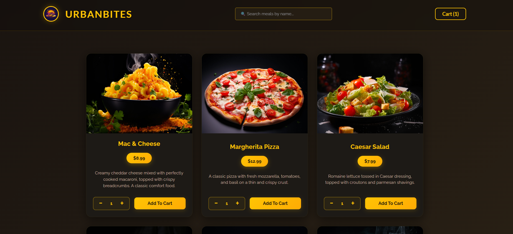
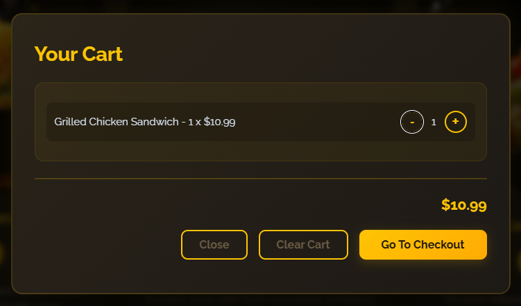
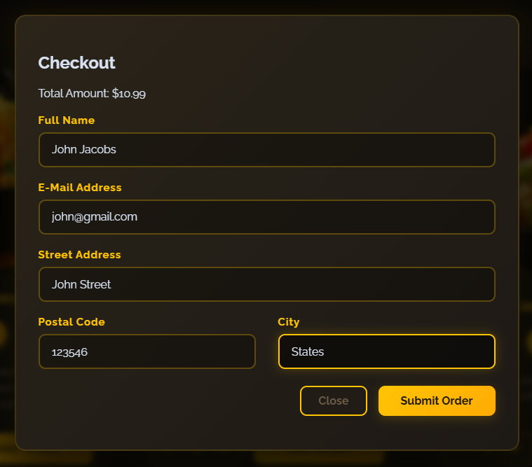

# UrbanBites — Food Delivery Web App

**Live Demo:** [urban-bites-food-delivery-website.vercel.app](https://urban-bites-food-delivery-website.vercel.app/)

A full-stack food ordering application where users can browse meals, manage a cart, and place orders. Built with React and Express as an end-to-end portfolio project.

[GitHub Repository](https://github.com/omkarsunilshivarkar/UrbanBites-Food-Delivery-Website)

---

## Features

- **Browse meals** — View a catalog of 20 meals with images, descriptions, and prices
- **Search** — Filter meals by name in real time
- **Shopping cart** — Add items with quantity, increase/decrease quantities, or clear the cart
- **Persistent cart** — Cart saved to `localStorage` and survives page refresh
- **Checkout** — Customer form with backend validation (name, email, address)
- **Order submission** — POST orders to the API with loading and success states
- **Toast notifications** — Feedback when items are added or errors occur
- **Responsive UI** — Dark-themed layout with modals for cart and checkout

---

## Tech Stack

| Layer | Technologies |
|-------|--------------|
| Frontend | React 19, Vite, Context API, `useReducer`, `useActionState` |
| Backend | Node.js, Express, body-parser |
| Data | JSON file storage (`available-meals.json`, `orders.json`) |
| Styling | Plain CSS |

---

## Screenshots

_Add screenshots to `docs/screenshots/` and they will appear here._

| Menu | Cart | Checkout |
|------|------|----------|
|  |  |  |

---

## Local Setup

### Prerequisites

- [Node.js](https://nodejs.org/) 18 or higher
- npm

### 1. Clone the repository

```bash
git clone https://github.com/omkarsunilshivarkar/UrbanBites-Food-Delivery-Website.git
cd UrbanBites-Food-Delivery-Website
```

### 2. Install dependencies

```bash
# Frontend
npm install

# Backend
cd backend
npm install
cd ..
```

### 3. Environment variables (optional)

Copy the example env file for local development:

```bash
cp .env.example .env
```

The frontend defaults to `http://localhost:3000` for the API if no env file is set.

### 4. Start the backend

```bash
cd backend
npm start
```

Server runs at **http://localhost:3000**

### 5. Start the frontend

In a separate terminal, from the project root:

```bash
npm run dev
```

App runs at **http://localhost:5173**

---

## API Endpoints

| Method | Endpoint | Description |
|--------|----------|-------------|
| `GET` | `/meals` | Returns the meal catalog |
| `POST` | `/orders` | Creates a new order |

### Order request body

```json
{
  "order": {
    "items": [
      { "id": "m1", "name": "Mac & Cheese", "price": "8.99", "quantity": 1 }
    ],
    "customer": {
      "name": "Jane Doe",
      "email": "jane@example.com",
      "street": "123 Main St",
      "postal-code": "10001",
      "city": "New York"
    }
  }
}
```

Meal images are served statically from the backend at `/images/<filename>.jpg`.

---

## Project Structure

```
UrbanBites-Food-Delivery-Website/
├── src/                    # React frontend
│   ├── components/         # UI components (Meals, Cart, Checkout, etc.)
│   ├── hooks/              # useHttp custom hook
│   ├── store/              # Cart, UserProgress, Toast contexts
│   └── util/               # Formatting helpers
├── backend/
│   ├── app.js              # Express server
│   ├── data/               # JSON data files
│   └── public/images/      # Meal images
├── docs/screenshots/       # README screenshots
├── index.html
├── package.json
└── vite.config.js
```

---

## Deployment

The application is deployed entirely to Vercel (both the frontend React SPA and the Express backend via Serverless Functions).

| Service | Role | Root directory |
|---------|------|----------------|
| Vercel | React SPA & Express API | project root |

The frontend communicates with the serverless backend using `/api` configured via rewrites in `vercel.json` and `VITE_BACKEND_URL` in `.env.production`.

---

## Limitations

- No user authentication — anyone can place orders
- Orders stored in a JSON file (not a database)
- On cloud free tiers, order data may reset when the server redeploys

---

## Future Improvements

- User authentication and order history
- Database-backed storage (PostgreSQL / MongoDB)
- Payment gateway integration (Stripe / Razorpay)
- Admin dashboard for managing meals and orders
- Email notifications on order confirmation

---

## License

This project is licensed under the [MIT License](LICENSE).
